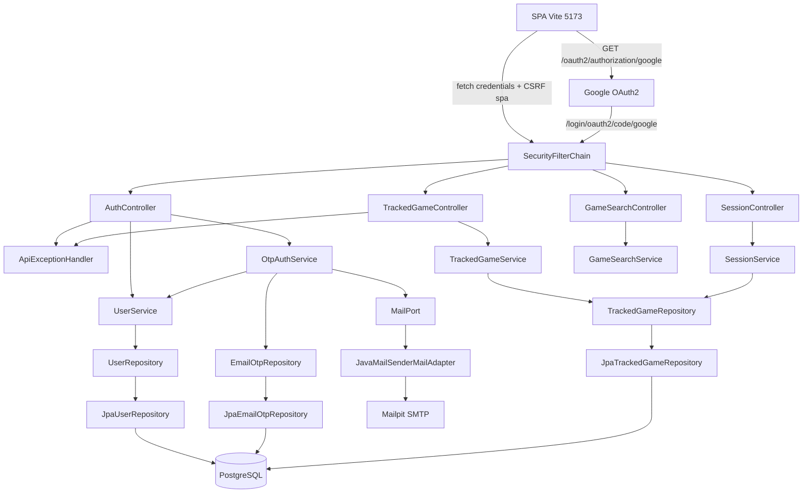

# Auth v1 Design

**Spec**: `.specs/features/auth-v1/spec.md`
**Context**: `.specs/features/auth-v1/context.md`
**Status**: Draft (Tasks drafted, awaiting Bruno approval)

---

## Architecture Overview

Hexagonal (AD-009). Core sem Spring, JPA, Feign nem Security. Casos de uso de auth são `*Service` / `*ServiceImpl`. Google callback e cookie de sessão ficam no adapter web + `config/`.

**Recomendação (travada):** cookie de `HttpSession` do servlet (Spring Security 7, Boot 4.1.1). OTP e Google estabelecem a mesma sessão. A SPA em `5173` manda o cookie para a API em `8080` com CORS `credentials` (AD-011).

Mesmo recorte de produto, três jeitos de carregar a sessão:

| Abordagem | O que é | Por que não / por que sim |
| --- | --- | --- |
| **A (escolhida)** | Cookie `HttpSession` HttpOnly + `SameSite=Lax`. OTP grava o `SecurityContext` na sessão. Google usa `oauth2Login()`. | Um mecanismo só. `oauth2Login` já é sessão. F5 reenvia o cookie. 7 dias via timeout + instante de emissão. |
| B | Bearer JWT no `Authorization`. OTP e Google emitem token. Front guarda em `localStorage`. | Dois mecanismos: Google no Security é sessão por omissão. Token no JS é XSS. CORS fica simples, mas o estudo de OAuth+sessão some. |
| C | Cookie + Spring Session Redis | Redis está fora do spec. Um processo local não precisa. |

Diário: todo `TrackedGame` passa a ter `userId`. Unique `(user_id, rawg_id)`. Linhas pré-auth ficam sem dono (`user_id` null) e nunca entram na listagem.

Google: paths padrão do Spring Security 7 — `GET /oauth2/authorization/google` e callback `{baseUrl}/login/oauth2/code/google`. Sem alias em `/auth/...`.



Pacotes novos (AD-009, sufixos AGENTS.md):

```
core/model/                 User
core/exception/             InvalidEmailException, InvalidOtpException,
                            OtpRateLimitedException, MailDeliveryException
core/port/in/               OtpAuthService, UserService
core/port/out/              UserRepository, EmailOtpRepository, MailPort
application/                OtpAuthServiceImpl, UserServiceImpl
                            TrackedGameServiceImpl / SessionServiceImpl (+ userId)
adapter/in/web/             AuthController, AuthUserResponse, Otp*Request
adapter/out/persistence/    UserEntity, EmailOtpEntity, Jpa*
adapter/out/mail/           JavaMailSenderMailAdapter
config/                     SecurityConfig, ApiAuthenticationEntryPoint
                            GoogleAuthSuccessHandler, GoogleAuthFailureHandler
```

`core/` não importa tipos de Security. O controller (ou o success handler Google) chama o use case e, no adapter, grava o `SecurityContext` na sessão.

---

## Code Reuse Analysis

### Existing Components to Leverage

| Component | Location | How to Use |
| --- | --- | --- |
| `ApiExceptionHandler` | `config/exception/ApiExceptionHandler.java` | Novos 401 (OTP), 429, 503. Corpo `{ status, error, message }` |
| `ApiErrorResponse` | `adapter/in/web/ApiErrorResponse.java` | Mesmo JSON de 401 sem sessão (entry point) e de OTP inválido |
| `CorsConfig` / `CorsProperties` | `config/CorsConfig.java`, `CorsProperties.java` | `allowCredentials(true)` + headers CSRF. Origins já são `http://localhost:5173` |
| `Clock` | `config/TimeConfig.java` | Expiração OTP 10 min, rate limit 60 s, sessão absoluta 7 dias |
| `TrackedGameService` / `SessionService` | `core/port/in`, `application/` | Passar `userId` em todo método de diário; 404 se o id não for do usuário |
| `TrackedGameRepository` | `core/port/out/TrackedGameRepository.java` | `existsByUserIdAndRawgId`, `findAllByUserIdOrderByIdAsc`, `findByIdAndUserId` |
| Flyway V1/V2 | `src/main/resources/db/migration/` | **V3** (próxima): `app_user`, OTP, `user_id` (AD-002) |
| `apiClient` / `gamesApi` | `frontend/src/api/` | `credentials: 'include'` + header CSRF em POST/PATCH/DELETE. Sem TanStack Query (AD-011) |
| shadcn `Button` / `Input` | `frontend/src/components/ui/` | Tela `/login` (AD-013) |
| `AppLayout` / `ErrorMessage` | `frontend/src/components/` | Logout no header; erros em PT |
| `BrowserRouter` | `frontend/src/App.tsx` | Rota `/login` + guarda nas rotas atuais |
| Lombok `@RequiredArgsConstructor` | adapters / services atuais | Mesmo estilo |
| Specs `@SpringBootTest` + Testcontainers | `config/RawgMockMvcIntegrationSpec` | Login real via OTP + `RecordingMailAdapter`. Sem `@WebMvcTest` (AD-004) |

### Integration Points

| System | Integration Method |
| --- | --- |
| Spring Security 7 (servlet) | `SecurityFilterChain` em `config/`. Starter `spring-boot-starter-security` (Maven Central 4.1.x) + `spring-boot-starter-security-oauth2-client` (Boot 4.1 renomeou o starter OAuth2 client) |
| Google OAuth 2 authorization code | `oauth2Login()`. YAML `spring.security.oauth2.client.registration.google`. Redirect URI no console Google: `http://localhost:8080/login/oauth2/code/google` |
| SMTP local | `MailPort` → `JavaMailSender`. Compose **Mailpit**. Sem SMTP de produção |
| PostgreSQL | Flyway V3. Sem `ddl-auto` (AD-002) |
| SPA Vite | `VITE_API_URL`; cookie same-site `localhost` (portas diferentes = origens diferentes, mesmo site) |

---

## Components

### SecurityConfig

- **Purpose**: `SecurityFilterChain` servlet. Quem entra sem sessão leva 401 JSON. OTP e Google abertos. Busca e diário autenticados.
- **Location**: `src/main/java/com/brunoandreotti/game_tracker/config/SecurityConfig.java`
- **Interfaces**:
  - `securityFilterChain(HttpSecurity): SecurityFilterChain`
  - `corsConfigurationSource(): CorsConfigurationSource` — mesma lista de `CorsProperties`
- **Dependencies**: Boot 4.1.1 `spring-boot-starter-security`, Security 7.0 `HttpSecurity` servlet (não WebFlux)
- **Reuses**: `CorsProperties`

Regras (Security 7 `authorizeHttpRequests`):

- `POST /auth/otp/request`, `POST /auth/otp/verify` — `permitAll`
- `GET /oauth2/authorization/**`, `GET /login/oauth2/code/**` — `permitAll`
- `POST /auth/logout` — `logoutUrl("/auth/logout")`, sucesso **204**, também sem sessão
- `GET /auth/me`, `/games/**`, `/tracked-games/**` — `authenticated`
- preflight `OPTIONS` — `permitAll`

Sem `formLogin` / `httpBasic`. Entry point: `ApiAuthenticationEntryPoint` (não `HttpStatusEntryPoint` sozinho — o spec exige corpo JSON).

CSRF: `csrf.spa()` (Security 7.0 servlet, docs oficiais SPA). Cookie `XSRF-TOKEN` (não HttpOnly) + header `X-XSRF-TOKEN`. A SPA lê o cookie em `localhost` (cookie não é por porta). Logout e OTP POST mandam o header.

CORS no filter chain (`http.cors(Customizer.withDefaults())`). `allowCredentials(true)`. Origins explícitas — nunca `*`.

Sessão (Boot 4.1.0 servlet docs):

```yaml
server:
  servlet:
    session:
      timeout: 7d
      cookie:
        http-only: true
        same-site: lax
        max-age: 7d
```

Além disso, no login gravamos `establishedAt` na sessão. Pedido protegido com idade > 7 dias invalida a sessão (AUTH-18). Timeout idle sozinho não garante prazo absoluto.

`oauth2Login`: `successHandler` / `failureHandler` nossos. Sucesso → `app.frontend.base-url` (`http://localhost:5173/`). Falha ou cancelamento → `http://localhost:5173/login?error=google`.

### ApiAuthenticationEntryPoint

- **Purpose**: 401 `{ status, error, message }` quando falta sessão em rota protegida.
- **Location**: `src/main/java/com/brunoandreotti/game_tracker/config/ApiAuthenticationEntryPoint.java`
- **Interfaces**: `AuthenticationEntryPoint.commence(...)`
- **Dependencies**: `ApiErrorResponse`
- **Reuses**: mesmo contrato do handler

### OtpAuthService / OtpAuthServiceImpl

- **Purpose**: Pedir e verificar OTP. Não conhece cookie.
- **Location**: `core/port/in/OtpAuthService.java`, `application/OtpAuthServiceImpl.java`
- **Interfaces**:
  - `requestOtp(email: String): void` — 204 no controller; 400 e-mail inválido; 429 < 60 s; 503 mail falhou
  - `verifyOtp(email: String, code: String): User` — cria usuário se não existir; 401 código ruim/expirado/invalidado
- **Dependencies**: `EmailOtpRepository`, `MailPort`, `UserService`, `Clock`
- **Reuses**: `TimeConfig` `Clock`

Regras no serviço (não no controller): trim + lowercase; válido = um `@`, local e domínio não vazios, sem espaços. Código 6 dígitos `SecureRandom`. Hash SHA-256 (`salt` aleatório + código) via JDK `MessageDigest` no core — sem Spring. Texto claro nunca no banco nem no HTTP. 5 falhas invalidam. Reenvio invalida o anterior (last-write-wins). Envio falhou → apaga o desafio e `MailDeliveryException`.

### UserService / UserServiceImpl

- **Purpose**: `findOrCreate` pelo e-mail normalizado. Um e-mail = um usuário (OTP e Google).
- **Location**: `core/port/in/UserService.java`, `application/UserServiceImpl.java`
- **Interfaces**: `findOrCreateByEmail(email: String): User`
- **Dependencies**: `UserRepository`
- **Reuses**: none

### MailPort / JavaMailSenderMailAdapter

- **Purpose**: Enviar o código. Falha de SMTP vira `MailDeliveryException`.
- **Location**: `core/port/out/MailPort.java`, `adapter/out/mail/JavaMailSenderMailAdapter.java`
- **Interfaces**: `sendOtp(toEmail: String, code: String): void`
- **Dependencies**: Boot 4.1.0 `JavaMailSender` se `spring.mail.host` está setado; `spring-boot-starter-mail`
- **Reuses**: YAML `spring.mail.host` / `port` (Mailpit `1025`)

Corpo do e-mail: texto simples com o código. From configurável (`app.mail.from`, default `game-tracker@localhost`).

### UserRepository / EmailOtpRepository

- **Purpose**: Persistência de `app_user` e desafio OTP.
- **Location**: `core/port/out/`
- **Interfaces**: User: `save`, `findByNormalizedEmail`. OTP: `save`, `findByEmail`, `deleteByEmail`
- **Dependencies**: domínio `User`, record de desafio
- **Reuses**: padrão `Jpa*Repository`

### AuthController

- **Purpose**: HTTP de OTP e `/auth/me`. Logout é o `logout` do Security, não este controller.
- **Location**: `adapter/in/web/AuthController.java`
- **Interfaces**:
  - `POST /auth/otp/request` — `{ "email" }` → 204
  - `POST /auth/otp/verify` — `{ "email", "code" }` → 200 `{ "email" }` + `SecurityContextRepository.saveContext` (Security 7.0 servlet session-management)
  - `GET /auth/me` — 200 `{ "email" }`
- **Dependencies**: `OtpAuthService`, `HttpSessionSecurityContextRepository`, `Clock`
- **Reuses**: `@RestController`, injeção no construtor

Verify autenticado: `UsernamePasswordAuthenticationToken.authenticated` com principal `User` (id + email). Sem senha.

### GoogleAuthSuccessHandler / GoogleAuthFailureHandler

- **Purpose**: Depois do code Google: e-mail OIDC → `UserService.findOrCreateByEmail` → mesma sessão que o OTP. Sem e-mail → falha, sem sessão.
- **Location**: `config/GoogleAuthSuccessHandler.java`, `GoogleAuthFailureHandler.java`
- **Interfaces**: `AuthenticationSuccessHandler` / `AuthenticationFailureHandler`
- **Dependencies**: `UserService`; principal OIDC (`email` claim). Getter exato (`OidcUser.getEmail()` vs atributo) confirmado no Execute contra o javadoc Security 7
- **Reuses**: `oauth2Login()` Security 7.0

UI Google: navegação top-level (`<a href="{VITE_API_URL}/oauth2/authorization/google">`), não `fetch`. O cookie nasce no callback em `8080`.

### TrackedGameService / SessionService (evolução)

- **Purpose**: Diário só do `userId` da sessão.
- **Location**: mesmos arquivos atuais
- **Interfaces**: todos os métodos ganham `userId`. `existsByRawgId` vira por usuário. GET/PATCH/DELETE de id alheio → `TrackedGameNotFoundException` (404, não 403)
- **Dependencies**: `TrackedGameRepository` atualizado
- **Reuses**: `DuplicateRawgIdException` só para o próprio usuário

Controllers web extraem `User` do `SecurityContext`. Core não vê Security.

### Auth frontend (thin)

- **Purpose**: Sessão no browser sem store global.
- **Location**: `frontend/src/api/apiClient.ts`, `authApi.ts`, `pages/LoginPage.tsx`, `App.tsx`, `AppLayout.tsx`
- **Interfaces**:
  - `apiRequest`: `credentials: 'include'`; em POST/PATCH/DELETE lê cookie `XSRF-TOKEN` e manda `X-XSRF-TOKEN`
  - `authApi`: `requestOtp`, `verifyOtp`, `logout`, `me`
  - `RequireSession`: componente de rota (React Router: envolve as rotas protegidas; se `me` der 401, `Navigate` para `/login`). Bruno: isso é um *route guard* — um wrapper, não um framework extra
  - 401 em `/games` ou `/tracked-games`: handler no `apiClient` (ignora `/auth/*`) → `/login`
- **Dependencies**: shadcn Button/Input, `ErrorMessage`
- **Reuses**: `ApiError`, `VITE_API_URL`, tema AD-012

`/login` fora do `AppLayout` (sem “Meus jogos” / “Buscar”). Dois passos na mesma rota. Copy PT (Agent's Discretion). Google: link, não botão que chama `fetch`. Query `?error=google` → mensagem PT.

Logout: `POST /auth/logout` + navegar `/login`. Só visível com sessão.

### Guia de estudo backend

- **Purpose**: Teoria + fluxo + classes deste repo.
- **Location**: `docs/study/auth-v1-backend.md`
- **Interfaces**: n/a
- **Dependencies**: código já mergeado
- **Reuses**: n/a

**Doc task, not this phase.** Escrever no **fim do Execute**. Design/Tasks não criam o arquivo.

---

## Data Models

### User

```java
Long id;
String email;          // normalizado: trim + lowercase, unique
Instant createdAt;
```

Tabela `app_user` (`user` é reservado no Postgres).

### EmailOtpChallenge

```java
String email;          // PK, normalizado
String codeHash;       // SHA-256(salt + code)
String salt;
Instant expiresAt;     // issuedAt + 10 min
int failureCount;      // 5 → delete
Instant requestedAt;   // rate limit 60 s
```

### TrackedGame (evolução)

```java
Long id;
Long userId;           // null = linha pré-auth, invisível na API
long rawgId;
// name, year, coverUrl, status, rating — iguais
```

**Relationships**: `TrackedGame.userId` → `User.id`. Unique `(user_id, rawg_id)`. `play_session` inalterado (FK para `tracked_game`).

### JSON (API)

OTP request: `{ "email" }`. Verify / me: `{ "email" }`. Diário e busca: formas de library-v1. Erro: `{ status, error, message }`.

### Flyway V3

1. `CREATE TABLE app_user`
2. `CREATE TABLE email_otp`
3. `ALTER TABLE tracked_game ADD COLUMN user_id BIGINT REFERENCES app_user (id)` — **nullable**
4. `DROP CONSTRAINT uq_tracked_game_rawg_id`
5. `CREATE UNIQUE INDEX uq_tracked_game_user_rawg ON tracked_game (user_id, rawg_id)` — no Postgres, `NULL user_id` não colide entre órfãos

Não migrar dono. Não apagar órfãos (AUTH-30: lista vazia **mesmo se** ainda existirem).

JPA: tirar `unique = true` de `rawg_id` em `TrackedGameEntity`. Unique composto na entidade.

---

## Error Handling Strategy

| Error Scenario | Handling | User Impact |
| --- | --- | --- |
| Sem sessão em busca / diário / `GET /auth/me` | `ApiAuthenticationEntryPoint` 401 JSON | SPA vai a `/login` |
| E-mail OTP inválido | `InvalidEmailException` → 400 | `{ status, error, message }` |
| OTP errado, expirado, invalidado, e-mail ≠ pedido, code ≠ 6 dígitos | `InvalidOtpException` → 401 | Sem sessão; UI PT em `/login` |
| 5ª falha | desafio apagado; próximo verify 401 | Precisa pedir de novo |
| Reenvio em menos de 60 s | `OtpRateLimitedException` → 429 | Sem e-mail novo |
| SMTP / Mailpit fora | `MailDeliveryException` → 503; desafio removido | Sem sessão |
| Google cancelado / erro / sem e-mail | failure handler; redirect `/login?error=google` | Mensagem PT; sem cookie de sessão |
| `rawgId` já acompanhado **neste** usuário | 409 | Igual hoje, escopo por usuário |
| Id de outro usuário | 404 | Não vaza existência |
| Logout com ou sem sessão | 204 | Idempotente |

OTP nunca entra no body de sucesso ou erro.

---

## Risks & Concerns

| Concern | Location (file:line) | Impact | Mitigation |
| --- | --- | --- | --- |
| Unique global `rawg_id` | `TrackedGameEntity.java:30`; `V1__tracked_games_and_sessions.sql:9` | Dois usuários não podem acompanhar o mesmo jogo | V3 drop + unique `(user_id, rawg_id)` |
| Serviço e repo sem dono | `TrackedGameServiceImpl.java:31`; `TrackedGameRepository.java:16`; `SessionServiceImpl.java:55` | Diário compartilhado | `userId` em toda leitura/escrita; specs de isolamento |
| CORS sem credentials | `CorsConfig.java:18-21` | Browser não manda cookie 5173→8080 | `allowCredentials(true)` + headers; CORS no `SecurityFilterChain` |
| `fetch` sem cookie | `frontend/src/api/apiClient.ts:26` | 401 após login | `credentials: 'include'` + CSRF header |
| Rotas abertas | `App.tsx:11-16`; `AppLayout.tsx:7-27` | UI sem login | `/login`, `RequireSession`, logout |
| Handler sem 401/429/503 | `ApiExceptionHandler.java:25-55` | OTP/rate/mail viram 500 | Novos `@ExceptionHandler` |
| Specs HTTP anônimos | `TrackedGameControllerSpec.groovy:39-41` | Suite vermelha no Execute | Login OTP real (`RecordingMailAdapter`) no `setup`; AD-003/004 |
| CSRF `spa()` vs origens | Security 7.0 `csrf.spa()` | Cookie CSRF pode não aparecer no JS se o browser tratar porta como origem rígida | Fallback no Execute: `GET` que devolve token JSON, ou `csrf.disable()` + SameSite+allowlist (estudo local) |
| Timeout idle ≠ 7 dias absolutos | Boot `server.servlet.session.timeout` | AUTH-18 falha se o cookie escorregar | `establishedAt` na sessão; recusar depois de 7 dias |
| Starter mail no 4.1.1 | Context7 Boot **4.1.0** cita `spring-boot-starter-mail` | Artifact pode ter sido renomeado como o OAuth2 client | Execute confere o artifact Boot 4.1.1; não inventar nome |
| Órfãos `user_id` null | V1 dados locais | Unique composto + nulls no Postgres | Aceito. Queries sempre filtram `user_id` da sessão |
| Google sem e-mail | claim ausente | Conta sem chave de identidade | Falha de login; sem sessão (spec) |

---

## Tech Decisions (only non-obvious ones)

| Decision | Choice | Rationale |
| --- | --- | --- |
| Sessão | Cookie `HttpSession` HttpOnly, `SameSite=Lax`, 7 dias | Unifica OTP + `oauth2Login`. SPA 5173 / API 8080: CORS credentials. AD-015 |
| Dono do diário | `user_id` nullable; unique por usuário | Isolamento real; órfãos pré-auth invisíveis. AD-016 |
| Framework | Spring Security servlet, não filtro caseiro | `oauth2Login` + sessão documentados. AD-017 |
| Google paths | Padrão Security 7: `/oauth2/authorization/google`, `/login/oauth2/code/google` | Spec deixa o adapter escolher. Console Google aponta para `8080` |
| Google YAML | `spring.security.oauth2.client.registration.google` + `scope: openid, profile, email` | Boot 4.1.0 OAuth2 **client** (não Authorization Server). Secrets no `.env` |
| OTP HTTP | Controllers nossos em `/auth/otp/*` | Spec travou os paths |
| Logout | `http.logout().logoutUrl("/auth/logout")` 204 | Security 7.0 `deleteCookies` da sessão |
| CSRF | `csrf.spa()` (Security **7.0**) | Cookie sessão exige CSRF. SPA oficial. Thin: um helper no `apiClient` |
| OTP hash | SHA-256 + salt no core (JDK) | Sem Security no core. Código de 6 dígitos nunca em claro |
| OTP store | Tabela Flyway, não só memória | Testcontainers já existe; relógio via `Clock` |
| Mail | `MailPort` + Mailpit no Compose | Spec local. Boot 4.1.0 `JavaMailSender` / `spring.mail.*` |
| 401 JSON | `AuthenticationEntryPoint` custom | `HttpStatusEntryPoint` não monta `{ status, error, message }` |
| Testes Google | Handler + `UserService`; diário via OTP real | AD-004: não fakeia serviço de diário. Mail/Google: double no adapter |
| Front Google | `<a href>` top-level | Redirect OAuth não cabe em `fetch` |
| Guia de estudo | `docs/study/auth-v1-backend.md` no **fim do Execute** | Pedido do Bruno. Doc task, not this phase |

**Project-level:** AD-015 (cookie), AD-016 (`user_id`), AD-017 (Spring Security) em `.specs/STATE.md`.

### Research notes (Context7)

Library IDs usados:

- `/spring-projects/spring-boot/v4.1.0` (parent do repo é **4.1.1**; 4.1.0 é a versão mais próxima no Context7)
- `/websites/spring_io_spring-security_reference_7_0` (Boot 4.1 puxa Security 7)
- `/websites/spring_io_spring-framework_current` (`JavaMailSender` / `MimeMessageHelper`)

Achados:

- Boot 4.1.0: `spring.security.oauth2.client.registration.google` (client login). Não usar `oauth2.authorizationserver` (fora do spec).
- Boot 4.1: starter OAuth2 client novo `spring-boot-starter-security-oauth2-client` (o `spring-boot-starter-oauth2-client` está deprecated).
- Security 7.0: `oauth2Login(withDefaults())`; `GET /oauth2/authorization/{registrationId}`; redirect default `{baseUrl}/login/oauth2/code/{registrationId}`; Google Console `localhost:8080/login/oauth2/code/google`.
- Security 7.0 servlet: gravar login programático com `SecurityContextHolder` + `HttpSessionSecurityContextRepository.saveContext`.
- Security 7.0: `csrf.spa()`; desligar CSRF é `csrf.disable()` se o cookie SPA falhar no Execute.
- Boot 4.1.0: `server.servlet.session.cookie.same-site`; mail `spring.mail.host` + `JavaMailSender`; testes internos do Boot usam **Mailpit**.
- `HttpStatusEntryPoint.commence` só inicia o esquema HTTP — corpo JSON é nosso.

**I don't know (não fabricar no Execute):**

- Se Boot **4.1.1** renomeou `spring-boot-starter-mail` como fez com o OAuth2 client.
- Getter Java exato do e-mail no principal OIDC Google (`OidcUser.getEmail()` vs `getAttribute("email")`).
- Se `csrf.spa()` + cookie `XSRF-TOKEN` é visível ao JS em `localhost:5173` em todos os browsers do estudo.
- Se Tomcat renova `cookie.max-age` a cada request (por isso `establishedAt`).
