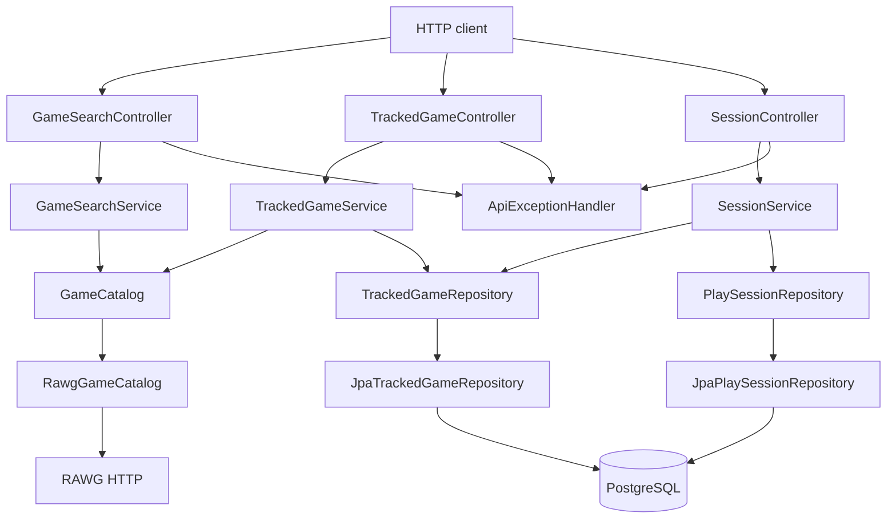

# Library v1 Design

**Spec**: `.specs/features/library-v1/spec.md`
**Context**: `.specs/features/library-v1/context.md`
**Status**: Draft

---

## Architecture Overview

Hexagonal prática (AD-005). O miolo é Java puro. Spring liga as bordas nas portas.

Camadas, sempre nesta ordem: controller → serviço (interface) → repositório/catálogo (interface). O Spring injeta a classe.

Zonas hexagonais (AD-009): `core/` (model, exception, port/in, port/out), `application/` (*ServiceImpl), `adapter/in/web`, `adapter/out/persistence`, `adapter/out/rawg`, `config/`.

Duas portas de banco: `TrackedGameRepository` e `PlaySessionRepository`. Catálogo: `GameCatalog` (AD-001). Schema Flyway, sem `ddl-auto` (AD-002).

HTTP de acompanhamento: `/tracked-games`. Busca: `/games/search`.

Outros jeitos que entregam a mesma API:

| Abordagem | O que é | Por que não |
| --- | --- | --- |
| **A (escolhida)** | Portas + adapters web/JPA/RAWG | Isola RAWG e o banco. Specs do miolo sem Spring |
| B | Controller chama Feign e JPA direto | Mistura camada. Teste de regra precisa de Spring |
| C | Uma porta só para jogo + sessões | Mais DDD do que o v1 pede. Dois serviços já existem |

Cliente HTTP: tentar Feign se o BOM fechar com Boot 4.1.1. Senão `@HttpExchange` do Boot 4.1.0. Só o adapter do catálogo importa esses tipos.



---

## Code Reuse Analysis

### Existing Components to Leverage

| Component | Location | How to Use |
| --- | --- | --- |
| Spring Boot app | `src/main/java/com/brunoandreotti/game_tracker/GameTrackerApplication.java` | Entrypoint. Não achatar tipos de feature neste pacote |
| YAML config | `src/main/resources/application.yaml` | Datasource, JPA, Flyway, URL do catálogo. Segredos no env |
| PostgreSQL driver | `pom.xml` | Já no classpath |
| Lombok | `pom.xml` annotation processor | `@RequiredArgsConstructor`, `@Getter` |
| `contextLoads` | `src/test/java/.../GameTrackerApplicationTests.java` | Manter verde com `PostgreSQLContainer` + `@ServiceConnection` (AD-003) |

### Integration Points

| System | Integration Method |
| --- | --- |
| RAWG | Adapter de `GameCatalog`. Paths e JSON oficiais no dia do código |
| PostgreSQL | Adapter JPA + Flyway. Compose `postgres`. Dia a dia: `mvn spring-boot:run` |
| HTTP API | `spring-boot-starter-webmvc` já presente |

---

## Components

### GameCatalog (porta)

- **Purpose**: Buscar e buscar por id do RAWG, sem tipos HTTP.
- **Location**: `src/main/java/com/brunoandreotti/game_tracker/core/port/out/GameCatalogPort.java`
- **Interfaces**:
  - `search(q: String): List<GameSummary>` — LIB-01, LIB-05
  - `getByRawgId(rawgId: long): GameSummary` — lança `GameNotFoundException` se o RAWG não tiver o id
- **Dependencies**: none (implementada pelo adapter)
- **Reuses**: none

`GameSummary` é um record: `rawgId`, `name`, `year` (`Integer`, nullable), `coverUrl` (`String`, nullable).

`CatalogUnavailableException` vira HTTP 502.

### RawgGameCatalog (adapter)

- **Purpose**: Chama o RAWG. Mapeia JSON para `GameSummary`. Falha de transporte vira `CatalogUnavailableException`.
- **Location**: `src/main/java/com/brunoandreotti/game_tracker/adapter/out/rawg/RawgGameCatalogAdapter.java`
- **Interfaces**: implements `GameCatalog`
- **Dependencies**: cliente HTTP (Feign ou `@HttpExchange` grupo `rawg`), `RAWG_API_KEY`
- **Reuses**: docs Boot 4.1.0 HTTP services ou OpenFeign se o BOM passar

Chave nunca no git. Placeholder no YAML, env `RAWG_API_KEY`.

### GameSearchService / GameSearchServiceImpl

- **Purpose**: Caso de uso da busca. Não grava. O controller não chama `GameCatalog`.
- **Location**: `src/main/java/com/brunoandreotti/game_tracker/core/port/in/GameSearchService.java`
- **Interfaces**: `search(q: String): List<GameSummary>`
- **Dependencies**: `GameCatalog`
- **Reuses**: none

### GameSearchController

- **Purpose**: `GET /games/search`
- **Location**: `src/main/java/com/brunoandreotti/game_tracker/adapter/in/web/GameSearchController.java`
- **Interfaces**: `search(q: String): List<GameSearchResponse>` — 200
- **Dependencies**: `GameSearchService`
- **Reuses**: `@RestController`, injeção no construtor

`q` em branco: Bean Validation `@NotBlank` → 400 (LIB-03).

### TrackedGame (domínio)

- **Purpose**: O jogo que você acompanha. Sem anotações JPA.
- **Location**: `src/main/java/com/brunoandreotti/game_tracker/core/model/TrackedGame.java`
- **Interfaces**: dados: `id`, `rawgId`, `name`, `year`, `coverUrl`, `status` (`PlayStatus`), `rating`
- **Dependencies**: `PlayStatus`
- **Reuses**: none

`totalMinutes` não é coluna. O serviço soma as sessões na leitura.

### PlaySession (domínio)

- **Purpose**: Uma sessão de jogo.
- **Location**: `src/main/java/com/brunoandreotti/game_tracker/core/model/PlaySession.java`
- **Interfaces**: `id`, `trackedGameId`, `durationMinutes`, `playedAt`
- **Dependencies**: none
- **Reuses**: none

### TrackedGameRepository (porta)

- **Purpose**: Gravar e ler `TrackedGame`.
- **Location**: `src/main/java/com/brunoandreotti/game_tracker/core/port/out/TrackedGameRepository.java`
- **Interfaces**: save, findById, findAllOrderByIdAsc, existsByRawgId, deleteById
- **Dependencies**: domínio `TrackedGame`
- **Reuses**: none

### PlaySessionRepository (porta)

- **Purpose**: Gravar, listar e apagar sessões de um jogo acompanhado.
- **Location**: `src/main/java/com/brunoandreotti/game_tracker/core/port/out/PlaySessionRepository.java`
- **Interfaces**: save, listByTrackedGameId ordered (`playedAt` desc, `id` desc), findByIdAndTrackedGameId, delete, sumDurationByTrackedGameId
- **Dependencies**: domínio `PlaySession`
- **Reuses**: none

### JpaTrackedGameRepository / JpaPlaySessionRepository (adapters)

- **Purpose**: Implementam as portas. Copiam domínio ↔ `TrackedGameEntity` / `PlaySessionEntity`. Spring Data fica interno ao pacote `adapter.persistence`.
- **Location**: `src/main/java/com/brunoandreotti/game_tracker/adapter/out/persistence/`
- **Interfaces**: implements as portas de application
- **Dependencies**: Flyway, PostgreSQL
- **Reuses**: `spring-boot-starter-data-jpa`

Delete do jogo acompanhado apaga sessões (FK `ON DELETE CASCADE` + cascade JPA).

### TrackedGameService / TrackedGameServiceImpl

- **Purpose**: Add, ler, patch, delete. Snapshot do catálogo no add. `rawgId` único. Status livre (LIB-20).
- **Location**: `src/main/java/com/brunoandreotti/game_tracker/core/port/in/TrackedGameService.java`
- **Interfaces**:
  - `add(rawgId, status?): TrackedGameResponse` — 201; 409 duplicata; 404 id RAWG; 502 catálogo fora
  - `list(): List<TrackedGameResponse>` — por id asc
  - `get(id): TrackedGameResponse`
  - `patch(id, status?, rating?): TrackedGameResponse`
  - `delete(id): void`
- **Dependencies**: `GameCatalog`, `TrackedGameRepository`, `PlaySessionRepository` (soma na leitura)
- **Reuses**: none

### TrackedGameController

- **Purpose**: `/tracked-games`
- **Location**: `src/main/java/com/brunoandreotti/game_tracker/adapter/in/web/TrackedGameController.java`
- **Interfaces**: POST, GET coleção, GET item, PATCH, DELETE
- **Dependencies**: `TrackedGameService`
- **Reuses**: `@RestController`

### SessionService / SessionServiceImpl

- **Purpose**: Criar, listar, apagar sessões. `totalMinutes` via a mesma SUM.
- **Location**: `src/main/java/com/brunoandreotti/game_tracker/core/port/in/SessionService.java`
- **Interfaces**:
  - `add(trackedGameId, durationMinutes, playedAt?): SessionResponse` — default `playedAt` = `LocalDate.now()` do servidor
  - `list(trackedGameId): List<SessionResponse>` — `playedAt` desc, `id` desc
  - `delete(trackedGameId, sessionId): void` — 404 se a sessão não for daquele jogo
- **Dependencies**: `TrackedGameRepository`, `PlaySessionRepository`
- **Reuses**: none

Sessão vale em qualquer `PlayStatus`.

### SessionController

- **Purpose**: `/tracked-games/{id}/sessions`
- **Location**: `src/main/java/com/brunoandreotti/game_tracker/adapter/in/web/SessionController.java`
- **Interfaces**: POST, GET, DELETE
- **Dependencies**: `SessionService`
- **Reuses**: `@RestController`

### ApiExceptionHandler

- **Purpose**: Mapeia falhas para `{ status, error, message }`.
- **Location**: `src/main/java/com/brunoandreotti/game_tracker/config/ApiExceptionHandler.java`
- **Interfaces**: `@RestControllerAdvice` para 400, 404, 409, 502
- **Dependencies**: exceções de `core/exception`
- **Reuses**: Spring MVC

### Persistence (schema)

- **Purpose**: Tabelas `tracked_game` e `play_session`
- **Location**: `src/main/resources/db/migration/V1__tracked_games_and_sessions.sql`
- **Interfaces**: unique `rawg_id`; FK `tracked_game_id` `ON DELETE CASCADE`
- **Dependencies**: Flyway, PostgreSQL
- **Reuses**: none

---

## Data Models

### TrackedGame

```java
Long id;
Long rawgId;              // unique, not null
String name;              // not null
Integer year;             // nullable
String coverUrl;          // nullable
PlayStatus status;        // WANT_TO_PLAY | PLAYING | COMPLETED | DROPPED
Integer rating;           // nullable, 1–10 when present
```

`totalMinutes` não é coluna.

### PlaySession

```java
Long id;
Long trackedGameId;
int durationMinutes;      // > 0
LocalDate playedAt;       // date only
```

### JSON (API)

Formas iguais a [docs/product.md](../../../docs/product.md). `id` é `Long`. Erro: `status` (int), `error`, `message`. Sem RFC 7807.

---

## Error Handling Strategy

| Error Scenario | Handling | User Impact |
| --- | --- | --- |
| `q` em branco / nota fora de 1–10 / `durationMinutes` ≤ 0 / PATCH vazio / status inválido / `playedAt` ruim | Bean Validation + handler 400 | `{ status: 400, error, message }` |
| Id de jogo acompanhado ou sessão desconhecido; `rawgId` inexistente no RAWG | handler 404 | `{ status: 404, error, message }` |
| `rawgId` duplicado | unique → 409 | `{ status: 409, error, message }` |
| RAWG timeout, conexão, 5xx | `CatalogUnavailableException` → 502 | `{ status: 502, error, message }` |
| Persistência falha depois do lookup RAWG | rollback; Boot 500 | Nenhum registro; sem contrato extra |
| RAWG `year` / `coverUrl` null | grava e serializa `null` | Add ainda 201 |

---

## Risks & Concerns

| Concern | Location (file:line) | Impact | Mitigation |
| --- | --- | --- | --- |
| Scaffold sem persistência. `contextLoads` quebra quando existir DataSource | `src/test/java/com/brunoandreotti/game_tracker/GameTrackerApplicationTests.java:7` | `mvn test` vermelho | `PostgreSQLContainer` + `@ServiceConnection` |
| Docker no `mvn test` | AD-003 | Falha sem Docker | Aceito. Specs do miolo sem Spring |
| Feign BOM vs Boot 4.1.1 | Context7 OpenFeign: sem BOM alinhado | Cloud train errada | Feign só com BOM estável. Senão `@HttpExchange` |
| Spock Maven + Groovy 4 | `/spockframework/spock` 2.4 | Classifier errado | Gate na implementação |
| Contrato HTTP do RAWG não está no repo | n/a | Adapter inventado | Primeira task do adapter: docs oficiais. Porta permanece `search` + `getByRawgId` |
| Sem auth | product | Qualquer cliente local chama a API | Aceito no v1. Sem Security |
| `GET /tracked-games` sem paginação | spec | Lista pessoal | Fora do recorte |

---

## Tech Decisions (only non-obvious ones)

| Decision | Choice | Rationale |
| --- | --- | --- |
| Forma | Hexagonal prática, camadas sem pulo (AD-005) | Controller não fala com porta de saída. Serviço e repositório são interface + classe |
| Nomes | `TrackedGame`, `/tracked-games`, pacote `tracking` | Casa com o rastreio. JSON de campos igual |
| Catálogo | `GameCatalog` (AD-001) | Troca o cliente HTTP sem mexer em `tracking` |
| Schema | Flyway, `ddl-auto: none` (AD-002) | Boot 4.1: Hibernate espera Flyway |
| Cliente HTTP | Gate Feign vs `@HttpExchange` | BOM 4.1.1 incerto; Boot 4.1.0 documenta HTTP services |
| `totalMinutes` | SUM na leitura | A soma é a regra. Coluna denormalizada desvia no delete |
| Status | Sem guarda além do enum | Qualquer um dos quatro, de qualquer valor atual |
| Testes | Unitário: `*ServiceImpl` sem Spring. Integração: Postgres e WireMock. Componente: `@SpringBootTest` real (AD-003, AD-004) | API testada como a gente chama |
| Validação | `spring-boot-starter-validation` nos DTOs | Boot 4 Web MVC liga o Validator |
| Compose | `compose.yaml` na raiz: Postgres + app | stack.md |
| Timeout | YAML `spring.http.clients` / serviceclient | Timeout → 502 |

**Project-level:** AD-001 a AD-005 em `.specs/STATE.md`. Feign vs HttpExchange continua local até o gate.

### Research notes (Context7)

- Spring Boot **4.1.0** (mais próximo do parent **4.1.1**): `spring-boot-starter-data-jpa`; `ddl-auto` default `none` fora de embedded; Flyway auto-config; HTTP services `@ImportHttpServices` + `spring.http.serviceclient.<group>.base-url`.
- Flyway: `V1__Description.sql`; default `db/migration`.
- OpenFeign: `@EnableFeignClients`, `@FeignClient`. Sem BOM Boot 4.1.1 no resultado.
- Spock **2.4**: JUnit Platform. Classifier Groovy 4 na implementação.
- Testcontainers: Boot 4.1 `spring-boot-testcontainers`, `@ServiceConnection`. WireMock: stubs JUnit.
