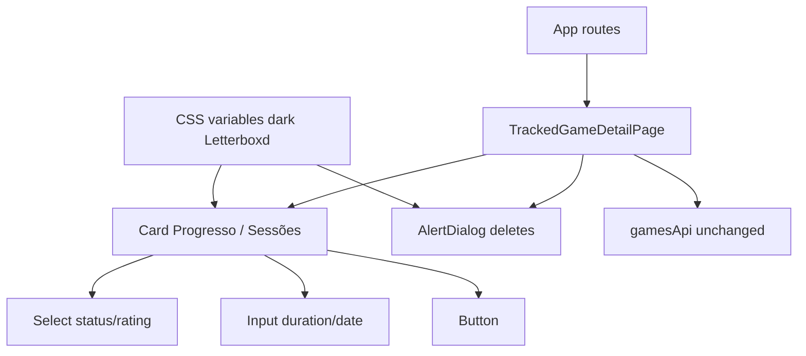

# UI shadcn Design

**Spec**: `.specs/features/ui-shadcn/spec.md`
**Context**: `.specs/features/ui-shadcn/context.md`
**Status**: Approved (AD-012/013 + detail-first; approach locked)

---

## Architecture Overview

Scaffold Tailwind + shadcn inside existing Vite SPA. Detail page swaps native form controls for owned shadcn components under `components/ui/`. `gamesApi` and route structure unchanged. Global CSS remains for layout/nav/list/search; detail page leans on Card + theme tokens.

**Approach (chosen):** A — shadcn owned components + Tailwind tokens. Rejected: Mantine (kit npm), full-app migration in one go.

---

## Code Reuse Analysis

| Component | Location | How to Use |
| --- | --- | --- |
| `TrackedGameDetailPage` | `frontend/src/pages/` | Rewrite markup; keep handlers/state |
| `gamesApi` / `ApiError` | `frontend/src/api/` | Unchanged |
| `playStatus` / `formatMinutes` | `frontend/src/lib/` | Unchanged |
| `CoverImage`, `ErrorMessage`, `LoadingMessage` | `frontend/src/components/Feedback.tsx` | Keep for cover/errors/loading |
| Detail tests | `TrackedGameDetailPage.test.tsx` | Update for Select/AlertDialog interactions |
| Dark visual tokens | AD-012 / `global.css` | Port primary colors into shadcn CSS variables |

### Integration Points

| System | Integration Method |
| --- | --- |
| Vite | `@tailwindcss/vite` + CSS entry |
| shadcn CLI | `init` + `add button card input select alert-dialog` |
| Vitest / TL | Existing gate `npm test` / `npm run build` |

---

## Components

### Tailwind + shadcn base

- **Purpose**: Tooling and theme foundation
- **Location**: `frontend/` (`components.json`, `src/index.css` or theme CSS, `src/lib/utils.ts` `cn`)
- **Dependencies**: Tailwind v4 Vite plugin, shadcn CLI
- **Reuses**: Existing Vite React TS app

### UI primitives (CLI-generated)

- **Purpose**: Owned Button, Card, Input, Select, AlertDialog
- **Location**: `frontend/src/components/ui/*`
- **Interfaces**: Standard shadcn exports; Select controlled via `value` / `onValueChange`
- **Dependencies**: Radix packages as pulled by CLI

### TrackedGameDetailPage (migrated)

- **Purpose**: Detail log UX with shadcn
- **Location**: `frontend/src/pages/TrackedGameDetailPage.tsx`
- **Interfaces**: Same page route; handlers unchanged semantically
- **Dependencies**: ui/* + gamesApi + Feedback cover/error

---

## Data Models

None new — reuse `TrackedGameDto`, `SessionDto`, `PlayStatus`.

---

## Error Handling

| Scenario | Handling |
| --- | --- |
| Invalid duration | Existing PT alert string; no API |
| Mutation API error | Existing `ErrorMessage` / alert |
| Delete cancel | AlertDialog cancel; no DELETE |
| 404 load | Existing empty-state path |

---

## Tech Decisions (feature-local)

| Decision | Choice | Rationale | Alternatives |
| --- | --- | --- | --- |
| Confirm UI | AlertDialog | shadcn study + in-app confirm | window.confirm |
| Theme entry | CSS variables + `.dark` on root | AD-012 dark-only | dual light/dark toggle |
| CSS coexistence | Keep `global.css` for shell | Slice limited to detail | Big-bang rewrite |
| Path aliases | Match shadcn Vite defaults (`@/`) | CLI expects them | relative-only imports |

Conforms to **AD-010** (frontend/), **AD-011** (thin fetch, Vitest), **AD-012** (dark Letterboxd), **AD-013** (shadcn).

---

## Risks & Concerns

| Concern | Mitigation |
| --- | --- |
| Select/AlertDialog break TL queries | Prefer accessible names; update tests with userEvent + dialog roles; gate `npm test` |
| Tailwind fights global.css | Scope new classes to detail; keep nav/list on global |
| CLI output differs by version | Context7 + official Vite guide on Execute day |
| Uncommitted dark polish already in tree | Include in first commits or commit polish before shadcn tasks |

---

## Testing Strategy

Same as ui-v1: Vitest + Testing Library. No E2E.

- Scaffold: build gate
- Detail: extend existing page tests for Select change, AlertDialog confirm/cancel, session refresh
- Theme: visual/build (no pixel tests)

---

## Migration Plan

1. Tailwind + shadcn init + theme tokens  
2. `add` primitives  
3. Migrate detail markup + AlertDialog state  
4. Fix tests + green gate  
