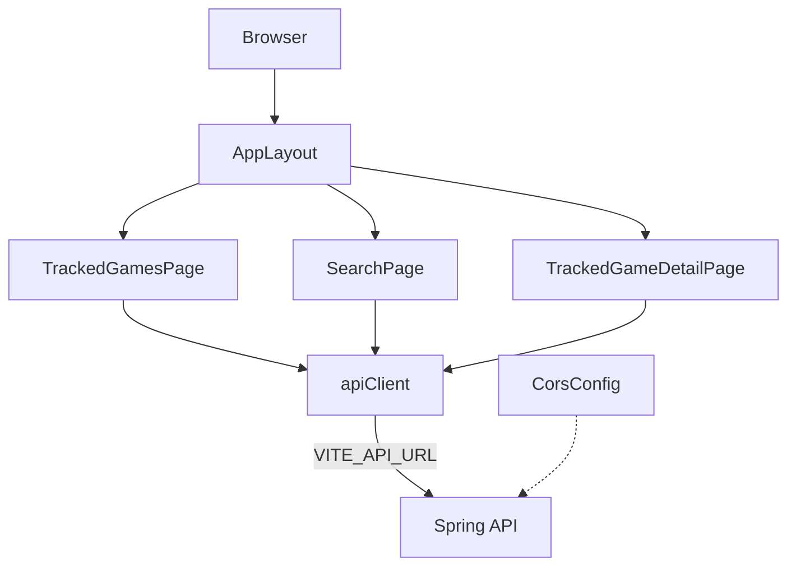

# UI v1 Design

**Spec**: `.specs/features/ui-v1/spec.md`
**Context**: `.specs/features/ui-v1/context.md`
**Status**: Approved

---

## Architecture Overview

SPA em `frontend/` (React + Vite + TypeScript) falando com a API Spring na raiz via HTTP. Sem store global, sem SSR.

| Abordagem | O que é | Por que não / sim |
| --- | --- | --- |
| **A (escolhida)** | Vite SPA + React Router (modo biblioteca) + `fetch` fino + CSS Variables/Modules | Menos conceitos; encaixa no aprendizado; AD-010 |
| B | React Router como framework (`ssr: false`) | Extra de convenções sem ganho local |
| C | Vite proxy sem CORS no Spring | Proxy ok no dev; CORS explícito no backend cobre qualquer origem configurada e é o contrato real |



**Glossário rápido (para quem está aprendendo React):**

| Termo | Significado aqui |
| --- | --- |
| **Componente** | Função TSX que devolve UI (ex. uma página) |
| **Estado (`useState`)** | Dados que mudam na tela (lista, loading, erro) |
| **Efeito (`useEffect`)** | “Quando a página monta / o id muda, busca na API” |
| **Rota** | URL → qual página mostrar (`/`, `/search`, `/games/:id`) |

---

## Code Reuse Analysis

### Existing Components to Leverage

| Component | Location | How to Use |
| --- | --- | --- |
| Contrato JSON | `docs/product.md`, controllers em `adapter/in/web` | Tipos TS espelham `TrackedGameResponse`, busca, sessões, erro |
| Coleção Bruno | `bruno/` | Referência manual dos endpoints no demo |
| Spring Boot app | raiz | CORS novo em `config/`; sem mudar contrato HTTP |

### Integration Points

| System | Integration Method |
| --- | --- |
| API library-v1 | `fetch` contra `import.meta.env.VITE_API_URL` (prefixo `VITE_` — [Vite env](https://vite.dev/guide/env-and-mode)) |
| CORS | `WebMvcConfigurer#addCorsMappings` — [Spring CORS](https://docs.spring.io/spring-framework/reference/web/webmvc-cors.html); origem default `http://localhost:5173` |
| Postgres / RAWG | Indireto via API; UI não fala com eles |

---

## Folder layout (`frontend/`)

```
frontend/
  package.json
  vite.config.ts
  index.html
  .env.example          # VITE_API_URL=http://localhost:8080
  src/
    main.tsx
    App.tsx             # BrowserRouter + rotas
    vite-env.d.ts       # ImportMetaEnv.VITE_API_URL
    styles/
      global.css        # variáveis, tipografia, reset leve
    api/
      apiClient.ts      # fetch + parse de erro
      types.ts          # DTOs alinhados à API
      gamesApi.ts       # search, tracked games, sessions
    lib/
      formatMinutes.ts  # totalMinutes → "2h 30min"
      playStatus.ts     # enum API ↔ label PT
    components/
      AppLayout.tsx     # nav Lista | Buscar
      LoadingMessage.tsx
      ErrorMessage.tsx
      CoverImage.tsx    # omite/placeholder se coverUrl null
    pages/
      TrackedGamesPage.tsx
      SearchPage.tsx
      TrackedGameDetailPage.tsx
```

---

## Components

### apiClient

- **Purpose**: Um único lugar para `fetch`, base URL, JSON e erros tipados.
- **Location**: `frontend/src/api/apiClient.ts`
- **Interfaces**:
  - `apiRequest<T>(path, init?): Promise<T>` — lança `ApiError` com `status` + `message` (do body ou genérica em PT)
  - `ApiError` — `status: number`, `message: string`, opcional `body`
- **Dependencies**: `import.meta.env.VITE_API_URL`
- **Reuses**: Contrato de erro `{ status, error, message }` da API

### gamesApi

- **Purpose**: Funções nomeadas por endpoint (sem React).
- **Location**: `frontend/src/api/gamesApi.ts`
- **Interfaces**:
  - `searchGames(q: string, exact?: boolean): Promise<GameSummaryDto[]>`
  - `listTrackedGames(): Promise<TrackedGameDto[]>`
  - `getTrackedGame(id: number): Promise<TrackedGameDto>`
  - `createTrackedGame(rawgId: number): Promise<TrackedGameDto>` — body só `{ rawgId }`
  - `patchTrackedGame(id, { status?, rating? }): Promise<TrackedGameDto>`
  - `deleteTrackedGame(id): Promise<void>`
  - `listSessions(trackedGameId): Promise<SessionDto[]>`
  - `createSession(trackedGameId, { durationMinutes, playedAt? }): Promise<SessionDto>`
  - `deleteSession(trackedGameId, sessionId): Promise<void>`
- **409**: a página de busca chama `listTrackedGames()`, acha o item com o mesmo `rawgId` e oferece link para `/games/{id}`; se não achar, link para `/`

### AppLayout

- **Purpose**: Chrome mínimo com links “Meus jogos” (`/`) e “Buscar” (`/search`).
- **Location**: `frontend/src/components/AppLayout.tsx`
- **Dependencies**: React Router `Link` / `Outlet`

### TrackedGamesPage (`/`)

- **Purpose**: Lista acompanhados; empty → CTA busca; clique → detalhe.
- **Location**: `frontend/src/pages/TrackedGamesPage.tsx`
- **Estado local**: `games`, `loading`, `error`
- **Dependencies**: `gamesApi.listTrackedGames`, `formatMinutes`, `playStatus`

### SearchPage (`/search`)

- **Purpose**: Query + checkbox “busca exata” + resultados + “Acompanhar”.
- **Location**: `frontend/src/pages/SearchPage.tsx`
- **Estado local**: `q`, `exact`, `results`, `loading`, `error`, `trackingRawgId` (anti double-submit)
- **Dependencies**: `gamesApi.searchGames`, `createTrackedGame`, `listTrackedGames` (409), `useNavigate`

### TrackedGameDetailPage (`/games/:id`)

- **Purpose**: Status, nota, sessões, deletes com `window.confirm`.
- **Location**: `frontend/src/pages/TrackedGameDetailPage.tsx`
- **Estado local**: `game`, `sessions`, `loading`, `error`, campos de formulário de sessão
- **Dependencies**: todos os mutators de `gamesApi`; link “Voltar” para `/`

### CoverImage / LoadingMessage / ErrorMessage

- **Purpose**: Evitar imagem quebrada; loading e erro reutilizáveis em PT.
- **Location**: `frontend/src/components/`

### CorsConfig (backend)

- **Purpose**: Permitir origem do Vite nos endpoints da API.
- **Location**: `src/main/java/.../config/CorsConfig.java`
- **Config**: `application.yaml` → `app.cors.allowed-origins` (lista; default `http://localhost:5173`)
- **Mapping**: `/**` com métodos usados pela UI (`GET`, `POST`, `PATCH`, `DELETE`, `OPTIONS`)
- **Dependencies**: Spring `WebMvcConfigurer` (sem Security)

---

## Data Models

```typescript
type PlayStatus = 'WANT_TO_PLAY' | 'PLAYING' | 'COMPLETED' | 'DROPPED'

interface GameSummaryDto {
  rawgId: number
  name: string
  year: number | null
  coverUrl: string | null
}

interface TrackedGameDto {
  id: number
  rawgId: number
  name: string
  year: number | null
  coverUrl: string | null
  status: PlayStatus
  rating: number | null
  totalMinutes: number
}

interface SessionDto {
  id: number
  durationMinutes: number
  playedAt: string // YYYY-MM-DD
}

interface ApiErrorBody {
  status: number
  error: string
  message: string
}
```

**Labels PT (`playStatus.ts`):**  
`WANT_TO_PLAY` → Quero jogar · `PLAYING` → Jogando · `COMPLETED` → Zerei · `DROPPED` → Dropado

**`formatMinutes(n)`:** `0` → `0 min`; `90` → `1h 30min`; `60` → `1h`; `45` → `45 min`

---

## Error Handling Strategy

| Error Scenario | Handling | User Impact |
| --- | --- | --- |
| Rede / API down | `apiClient` captura falha de `fetch` | “Não foi possível alcançar a API.” |
| 400/404/502 + body | Usa `message` do JSON | Texto da API na UI |
| 409 no acompanhar | Mensagem + link ao jogo existente ou `/` | Não cria duplicata |
| Validação local (q vazio, minutos ≤ 0) | Sem request | Mensagem PT no formulário |
| 404 no detalhe | Estado not-found | Mensagem + link para `/` |
| DELETE | `window.confirm` antes do request | Evita clique acidental |
| Mutação falhou | Mantém último sucesso na tela; mostra erro | Dados não somem |

---

## Testing Strategy

| Nível | Ferramenta | O que cobre |
| --- | --- | --- |
| Unit | Vitest | `formatMinutes`, `playStatus` labels |
| Unit | Vitest + mock `fetch` | `apiClient` / `gamesApi` (200, 400 com body, rede) |
| Component | Vitest + Testing Library | Empty state da lista; submit busca com q vazio não chama API |
| Manual | Browser | Demo “pronto quando” completo |

Sem E2E (Playwright/Cypress) no v1.

---

## Risks & Concerns

| Concern | Location | Impact | Mitigation |
| --- | --- | --- | --- |
| CORS ausente hoje | backend sem `Cors*` | Browser bloqueia a SPA | Task de `CorsConfig` + YAML na Execute |
| Segredo no front | N/A | `VITE_*` é público no bundle | Só URL da API; nunca chave RAWG no front |
| Bruno novo em React | — | Risco de sobrecarga de libs | Stack mínima; glossário no design; sem Redux/Query |
| 409 sem id no body | API só mensagem | Link ao detalhe precisa de GET lista | Busca por `rawgId` na lista após 409 |
| Capas externas (RAWG URLs) | `coverUrl` | Link quebrado / hotlink | `CoverImage` omite se null; `onError` esconde |

---

## Tech Decisions (non-obvious)

| Decision | Choice | Rationale |
| --- | --- | --- |
| Router | `react-router` modo biblioteca: `BrowserRouter` + `Routes` | Mais simples que data router / framework mode para aprender ([docs](https://github.com/remix-run/react-router)) |
| HTTP | `fetch` + `apiClient` | Zero lib extra; Bruno já conhece HTTP |
| Estado servidor | `useState` + `useEffect` por página | Sem TanStack Query no v1 |
| CSS | `global.css` (variáveis) + CSS Modules só onde precisar | Legível; sem Tailwind |
| Vite env | `VITE_API_URL` + `.env.example` | Prefixo exigido pelo Vite |
| Porta Vite | Default `5173` | Alinha com CORS default |
| Confirmação DELETE | `window.confirm` | Spec; zero UI de modal custom |
| Testes | Vitest + Testing Library | Padrão Vite; cobre ACs críticos sem E2E |

**Project-level:** AD-010 já cobre pasta/stack. Nova **AD-011**: CORS configurável + client HTTP fino sem state library (ver STATE).

---

## Execute gate (obrigatório)

1. Bruno aprova este design (ou pede ajustes).
2. Em seguida: fase **Tasks** (`tasks.md`) — ainda sem código.
3. **Código** (`frontend/`, `CorsConfig`, deps) **somente** depois de permissão explícita do Bruno (“pode implementar” / “pode gerar o código”).

---

## Mapping to requirements (Design)

Todos os `UI-01`…`UI-27` entram em Design; mapeamento fino para tasks na fase Tasks.
